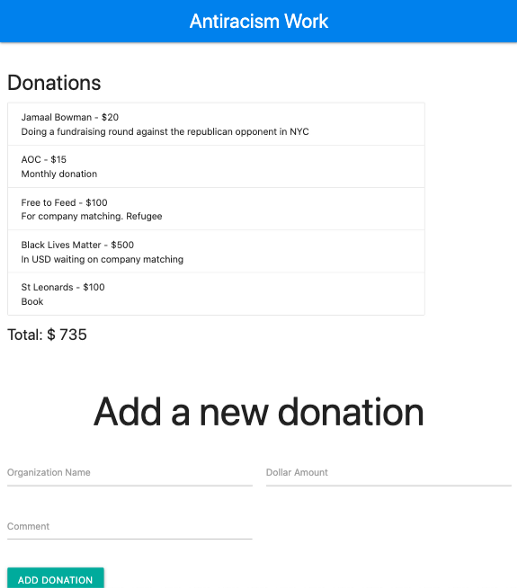

# ANTIRACISM TRACKING

A MERN app to track my antiracism

Please see my [medium article](https://medium.com/weekly-webtips/building-restful-apis-with-node-js-and-express-a9f648219f5b) for reference.

And here is [part two](https://medium.com/@nikki.ricks/mern-part-ii-building-the-frontend-of-a-restful-api-with-react-d10f11a9f19c)

## Getting Started

In your terminal do a git clone of the project

Then run:

`npm install`

## Backend

To start up the backend from the root file

`cd backend`

`npm start`

In the terminal should see "Your server is running on port 4000"

## Frontend

To start up the frontend
Open a new terminal window

` cd ..`

`cd frontend`

`npm start`

You can navigate to http://localhost:3000 to see the app

### Challenges

I ran into issues with CORS so spent some time debugging with this [article](https://stackoverflow.com/questions/43871637/no-access-control-allow-origin-header-is-present-on-the-requested-resource-whe).

I realized it may be an Axios issue and found a solution on [this Github board](https://github.com/axios/axios/issues/853).

I finally got it to work by adding in the backend/index.js file the following code:

`app.use(function(req, res, next) { res.header('Access-Control-Allow-Origin', '*'); res.header('Access-Control-Allow-Headers', 'Origin, X-Requested-With, Content-Type, Accept'); next(); });`
